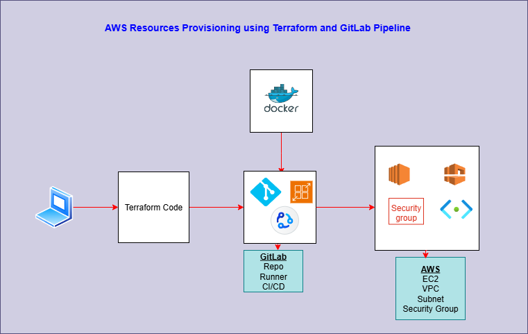

# Terraform-demo


## Terraform code created to provision resources in AWS Cloud
```
Created resources in AWS Cloud using Terraform.
Resources provisioned:
    EC2
    VPC
    subnets 
    SSH-Key
    Security Group
The Terraform state file will be stored in S3 bucket.
Resource creation from local machine to AWS Cloud was checked manually and verified. 
EC2 instance has been SSH'd from local machine successfully.
```


## Deploy code to AWS Cloud using GitHub Actions CI/CD pipeline
```
Create GitHub Actions CI/CD configuration file - done.
Test and deploy code using the CI/CD pipeline - done.
```


## Tools used in the project
```
AWS Cloud
AWS CLI
Terraform
VSCode to write the Terraform code
Git/GitHub
GitHub Actions CI/CD
YAML for pipeline script
Docker for for images
Bash shell script
```


## Solution Diagram



## Author
```
Tee Gobezie
```